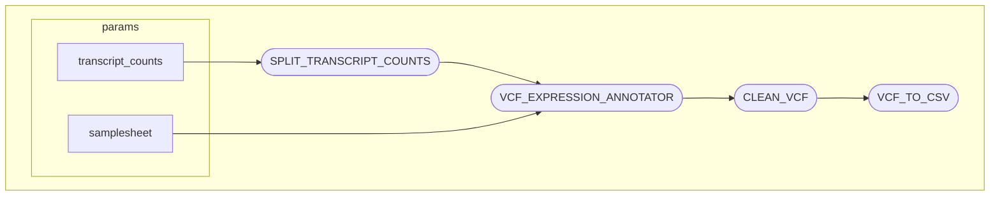

# VCF Expression Annotator

This nextflow pipeline is designed to add transcript-level expression values from nf-core/rnaseq to a VEP-annotated VCF file from nf-core/sarek

This pipeline is intended to improve usability of the existing [vcf-expression-annotator - VAtools](https://github.com/griffithlab/VAtools) from the Griffith Lab. 

## Workflow



## Input

This pipeline requires four mandatory command-line parameters:
```bash
nextflow run main.nf \
    --patient_id 'PID_123_' \
    --samplesheet 'path/to/samplesheet.csv' \
    --transcript_counts 'path/to/transcript_counts.tsv' \
    --outdir_base 'results'
```
### Parameter descriptions:

| Parameter	| Type	| Description |
| --------- | ----- | ----------- |
--patient_id | string | Patient identifier prefix used to match sample IDs in transcript counts files. Must end with an underscore (e.g., 'PID_123_') |
--samplesheet | file path | CSV file containing sample metadata and VCF file paths (see format below) |
--transcript_counts | file path | Merged transcript counts file generated from nf-core/rnaseq pipeline |
--outdir_base | string | Base output directory where all results will be stored |

#### Samplesheet Format
The samplesheet must be a csv file with the following columns:
| Column | Description |
| ------ | ----------- |
| sample_id | Unique sample identifier that matches the sample names in your transcript counts file |
| vcf_path | Full or relativee path to the VEP-annotated VCF file for this sample (from nf-core/sarek) |
| vcf_tumor_sample | Tumor sample name as it appears in the VCF file header |

#### Example Samplesheet
```bash
sample_id,vcf_path,vcf_tumor_sample
SAMPLE_A,/data/vcfs/tumor_SAMPLE_A_vs_normal_SAMPLE_A.mutect2.filtered_VEP.ann.chr22.vcf.gz,PATIENT001_SAMPLE_A_tumor_SAMPLE_A
SAMPLE_B,/data/vcfs/tumor_SAMPLE_B_vs_normal_SAMPLE_B.mutect2.filtered_VEP.ann.chr22.vcf.gz,PATIENT002_SAMPLE_B_tumor_SAMPLE_B
SAMPLE_C,data/vcfs/tumor_SAMPLE_C_vs_normal_SAMPLE_C.mutect2.filtered_VEP.ann.chr22.vcf.gz,PATIENT003_SAMPLE_C_tumor_SAMPLE_C
```

#### Transcript Counts File
This transcript counts file should be the merged transcript counts file from the nf-core/rnaseq pipeline, typically named 'salmon.merged.transcript_counts.tsv'
- This file should contain:
    - First column: transcript IDs
    - Subsequent columns: sample-specific transcript counts
    - Column headeres should following the pattern: {patient_id}(sample_id) (e.g., PID_123_SAMPLE_A)

## Output

For each sample, there are two outputs of interest:
- The 'cleaned' VEP-annotated VCF file with a new 'TX' FIELD found in the FORMAT column
- The cleaned VCF file in CSV format containing select columns:

The pipeline will create the following directory structure under --outdir_base:
```bash
results/
├── split_transcript_counts/     # Individual sample transcript count files
├── vcf_expression_annotator/    # VCF files annotated with expression data
└── clean_vcf/                   # Cleaned and processed VCF files and csv files
```

## Example usage

### With Docker
```bash
nextflow run main.nf -profile docker \
    --patient_id 'PID_262622_' \
    --samplesheet 'metadata/samplesheet.csv' \
    --transcript_counts 'data/salmon.merged.transcript_counts.tsv' \
    --outdir_base 'results'
```

### With Singularity
```bash
nextflow run main.nf -profile singularity \
    --patient_id 'PID_262622_' \
    --samplesheet 'metadata/samplesheet.csv' \
    --transcript_counts 'data/salmon.merged.transcript_counts.tsv' \
    --outdir_base 'results'
```

### Test Profile

#### With Docker
```bash
nextflow run main.nf -profile test,docker
```

#### With Singularity
```bash
nextflow run main.nf -profile test,singularity
```

## Troubleshooting

### Common Issues:
- Missing underscore in patient_id: Ensure your --patient_id ends with an underscore
- Sample ID mismatch: Verify that sample IDs in the samplesheet match those in the transcript counts file
- VCF file not found: Check that all paths in the vcf_path column are correct and accessible
- VCF sample name mismatch: Ensure vcf_tumor_sample exactly matches the sample name in the VCF header

### Parameter validation
This pipeline will validate all required parameters before execution and provide helpful error messages if any are missing are correct

## nf-test

The nf-test infrastructure is set up for unit testing. If you'd like to contribute, have nf-test installed and run the following to ensure nothing breaks:
```bash
nf-test test . --profile test,docker --verbose
```
