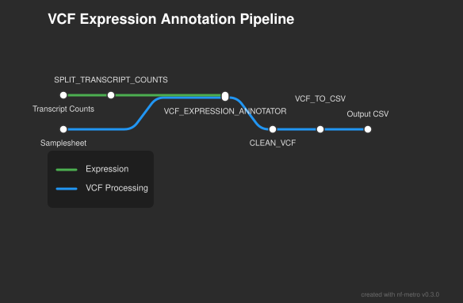

# VCF Expression Annotator

[](https://www.nextflow.io/)
[](https://www.docker.com/)
[](https://www.nf-test.com/)

Nextflow pipeline that annotates VCF variants with RNA-seq transcript expression data using [vcf-expression-annotator](https://github.com/griffithlab/VAtools). Integrates output from [nf-core/rnaseq](https://nf-co.re/rnaseq) and [nf-core/sarek](https://nf-co.re/sarek).



## Quick Start

```bash
nextflow run main.nf -profile test,docker  # Test run

nextflow run main.nf -profile docker \
    --patient_id 'PID_262622_' \
    --samplesheet samplesheet.csv \
    --transcript_counts salmon.merged.transcript_counts.tsv \
    --outdir results
```

**Requirements:** Nextflow ≥23.04.0, Docker/Singularity

## Input

**Samplesheet CSV** (`--samplesheet`):
```csv
sample_id,vcf_path,vcf_tumor_sample
SAMPLE_A,/data/vcfs/sample_A.vcf.gz,PATIENT001_tumor_SAMPLE_A
```

**Transcript counts TSV** (`--transcript_counts`): Output from nf-core/rnaseq at `results/star_salmon/salmon.merged.transcript_counts.tsv`

**Required parameters:**
- `--patient_id`: Patient prefix (must end with `_`)
- `--samplesheet`: CSV with sample metadata
- `--transcript_counts`: Merged transcript counts TSV
- `--outdir`: Output directory

## Output

Annotated VCFs with TX field containing transcript expression:
```
results/clean_vcf/
├── {sample_id}.clean.vcf    # TX field: ENST00000456328:150.5|ENST00000450305:45.2
└── {sample_id}.clean.csv    # CSV export
```

## Testing

This pipeline uses [nf-test](https://www.nf-test.com/) for automated testing with the `nft-vcf` and `nft-csv` plugins.

### Prerequisites

Install nf-test (requires Java 11+):

```bash
curl -fsSL https://code.askimed.com/install/nf-test | bash
mv nf-test /usr/local/bin/   # or anywhere on your PATH
```

### Run all tests

```bash
nf-test test
```

This uses the configuration in `nf-test.config`, which automatically applies the `test,docker` profile and loads the required plugins.

### Run specific tests

```bash
# Full pipeline integration test
nf-test test tests/main.nf.test

# Individual module tests
nf-test test tests/modules/split_transcript_counts.nf.test
nf-test test tests/modules/vcf_expression_annotator.nf.test
nf-test test tests/modules/clean_vcf.nf.test
nf-test test tests/modules/vcf_to_csv.nf.test
```

### Test data

Test fixtures live in `tests/data/` and the sample sheet used for testing is at `tests/samplesheet.csv`. The test profile (`-profile test`) configures paths to these fixtures automatically.

## Troubleshooting

- Ensure `--patient_id` ends with `_`
- `sample_id` should NOT include patient_id prefix
- Verify VCF sample names: `bcftools query -l file.vcf.gz`
- Empty TX field? Check transcript IDs match between VCF and counts file

## Citation

Gross, T. (2025). VCF Expression Annotator. https://github.com/tylergross97/vcf_expression_annotation

## License

MIT License
