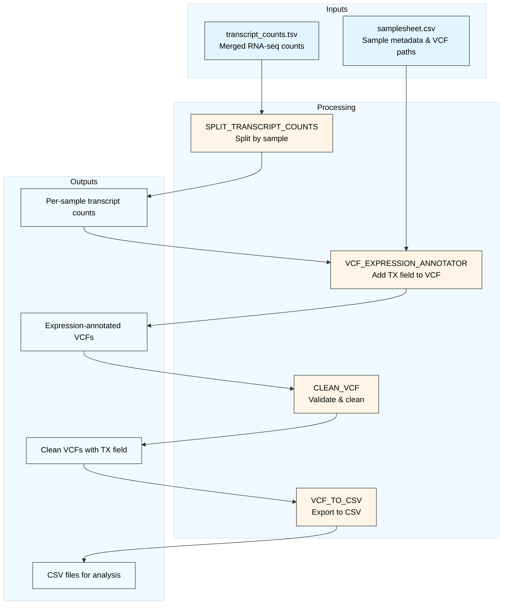

# VCF Expression Annotator

[](https://www.nextflow.io/)
[](https://www.docker.com/)
[](https://sylabs.io/docs/)
[](https://www.nf-test.com/)

> **Integrate transcript-level expression data into VEP-annotated VCF files for expression-aware variant analysis**

A Nextflow DSL2 pipeline that seamlessly combines RNA-seq transcript expression data from [nf-core/rnaseq](https://nf-co.re/rnaseq) with VEP-annotated variant calls from [nf-core/sarek](https://nf-co.re/sarek). This enables researchers to prioritize variants based on transcript expression levels—critical for identifying functionally relevant mutations in cancer genomics and other applications.

This pipeline provides production-ready Nextflow functionality for [vcf-expression-annotator](https://github.com/griffithlab/VAtools) from the Griffith Lab VAtools suite.

## 📋 Table of Contents

- [Why Use This Pipeline?](#-why-use-this-pipeline)
- [Features](#-features)
- [Workflow Overview](#-workflow-overview)
- [Quick Start](#-quick-start)
- [Installation](#-installation)
- [Usage](#-usage)
  - [Required Parameters](#required-parameters)
  - [Input Files](#input-files)
  - [Configuration Options](#configuration-options)
- [Output](#-output)
- [Examples](#-examples)
- [Testing](#-testing)
- [Performance Optimization](#-performance-optimization)
- [Troubleshooting](#-troubleshooting)
- [Contributing](#-contributing)
- [Citations](#-citations)
- [License](#-license)

## 🎯 Why Use This Pipeline?

**Problem:** Variant calling pipelines identify thousands of mutations, but not all are functionally relevant. Integrating expression data helps prioritize variants in actively transcribed genes.

**Solution:** This pipeline automatically:
- ✅ Annotates each variant with the expression level of affected transcripts
- ✅ Processes multiple samples in parallel with automatic channel management
- ✅ Maintains reproducibility with containerized tools (Docker/Singularity)
- ✅ Generates both VCF and CSV outputs for flexible downstream analysis
- ✅ Validates data integrity with built-in quality control steps

**Use Cases:**
- **Cancer Genomics**: Prioritize somatic variants in highly expressed transcripts for neoantigen prediction
- **Rare Disease**: Filter variants in genes with sufficient expression evidence
- **Variant Interpretation**: Add functional context to clinical variant reports
- **Multi-omics Integration**: Combine DNA and RNA sequencing data systematically

## ✨ Features

- 🧬 **Expression Integration**: Adds transcript-level expression values to VCF INFO/FORMAT fields
- ⚡ **Parallel Processing**: Automatic sample-level parallelization for efficient batch processing
- 📦 **Fully Containerized**: Docker and Singularity support ensures reproducibility across environments
- 🔍 **Quality Control**: Built-in VCF validation and cleaning steps
- 📊 **Multiple Outputs**: Generates both VCF (for pipelines) and CSV (for analysis) formats
- 🧪 **Tested**: Comprehensive nf-test suite with example data
- 🔄 **Resume Support**: Nextflow's resume functionality for interrupted runs
- 📝 **Detailed Logging**: Comprehensive execution reports and logs

## 📊 Workflow Overview


```mermaid
%%{init: {'theme':'base', 'themeVariables': { 'primaryColor':'#e1f5ff','primaryTextColor':'#000','primaryBorderColor':'#333','lineColor':'#333','secondaryColor':'#fff4e6','tertiaryColor':'#f0f9ff','nodeTextColor':'#000','textColor':'#000','labelTextColor':'#000'}}}%%
graph TB
    subgraph Inputs
        A[transcript_counts.tsv<br/>Merged RNA-seq counts]
        B[samplesheet.csv<br/>Sample metadata & VCF paths]
    end
    
    subgraph Processing
        C[SPLIT_TRANSCRIPT_COUNTS<br/>Split by sample]
        D[VCF_EXPRESSION_ANNOTATOR<br/>Add TX field to VCF]
        E[CLEAN_VCF<br/>Validate & clean]
        F[VCF_TO_CSV<br/>Export to CSV]
    end
    
    subgraph Outputs
        G[Per-sample transcript counts]
        H[Expression-annotated VCFs]
        I[Clean VCFs with TX field]
        J[CSV files for analysis]
    end
    
    A --> C
    B --> D
    C --> G
    G --> D
    D --> H
    H --> E
    E --> I
    I --> F
    F --> J
    
    style A fill:#e1f5ff,color:#000
    style B fill:#e1f5ff,color:#000
    style C fill:#fff4e6,color:#000
    style D fill:#fff4e6,color:#000
    style E fill:#fff4e6,color:#000
    style F fill:#fff4e6,color:#000
    style G fill:#f0f9ff,color:#000
    style H fill:#f0f9ff,color:#000
    style I fill:#f0f9ff,color:#000
    style J fill:#f0f9ff,color:#000
```

### Process Details

| Process | Description | Key Output |
|---------|-------------|------------|
| **SPLIT_TRANSCRIPT_COUNTS** | Splits merged transcript counts into individual sample files | `{patient_id}{sample_id}.tsv` |
| **VCF_EXPRESSION_ANNOTATOR** | Annotates VCF with expression data using VAtools | `{sample_id}.expression.vcf` with `TX` field |
| **CLEAN_VCF** | Cleans and validates annotated VCF files | `{sample_id}.clean.vcf` |
| **VCF_TO_CSV** | Converts VCF to tabular CSV format | `{sample_id}.clean.csv` |

## 🚀 Quick Start

```bash
# Test the pipeline with example data (Docker)
nextflow run main.nf -profile test,docker

# Test with Singularity (for HPC environments)
nextflow run main.nf -profile test,singularity

# Run with your own data
nextflow run main.nf -profile docker \
    --patient_id 'PID_262622_' \
    --samplesheet 'samplesheet.csv' \
    --transcript_counts 'salmon.merged.transcript_counts.tsv' \
    --outdir 'results'
```

## 📦 Installation

### Prerequisites

| Requirement | Minimum Version | Notes |
|-------------|----------------|-------|
| [Nextflow](https://www.nextflow.io/docs/latest/getstarted.html) | ≥23.04.0 | Install with: `curl -s https://get.nextflow.io \| bash` |
| Container Engine | - | Choose Docker **OR** Singularity |
| └─ [Docker](https://docs.docker.com/get-docker/) | ≥20.10 | Recommended for local development |
| └─ [Singularity](https://sylabs.io/guides/3.0/user-guide/installation.html) | ≥3.0 | Required for HPC environments |
| Git | ≥2.0 | For cloning the repository |

### Clone the Repository

```bash
# Clone the pipeline
git clone https://github.com/tylergross97/vcf_expression_annotation.git
cd vcf_expression_annotation

# Verify installation with test data
nextflow run main.nf -profile test,docker
```

## 🔧 Usage

### Required Parameters

All four parameters are **mandatory** unless using the `-profile test`:

```bash
nextflow run main.nf \
    --patient_id 'PID_123_' \          # Patient identifier prefix (MUST end with _)
    --samplesheet 'samples.csv' \       # Sample metadata CSV
    --transcript_counts 'counts.tsv' \  # Merged transcript counts from nf-core/rnaseq
    --outdir 'results'                  # Output directory
```

#### Parameter Details

| Parameter | Type | Description | Example |
|-----------|------|-------------|---------|
| `--patient_id` | String | Patient identifier prefix for matching sample IDs.<br/>⚠️ **Must end with underscore** | `'PID_262622_'` |
| `--samplesheet` | Path | CSV file with sample metadata and VCF locations | `'metadata/samples.csv'` |
| `--transcript_counts` | Path | Merged transcript counts TSV from nf-core/rnaseq | `'salmon.merged.transcript_counts.tsv'` |
| `--outdir` | String | Base directory for all pipeline outputs | `'results'` or `'output'` |

> 💡 **Tip**: Use the test profile (`-profile test,docker`) to validate your setup before processing real data.

### Input Files

#### 1. Samplesheet Format (`--samplesheet`)

A **CSV file** (comma-separated, not tab-separated) with three required columns:

```csv
sample_id,vcf_path,vcf_tumor_sample
SAMPLE_A,/data/vcfs/tumor_SAMPLE_A_vs_normal.mutect2.filtered_VEP.ann.vcf.gz,PATIENT001_tumor_SAMPLE_A
SAMPLE_B,/data/vcfs/tumor_SAMPLE_B_vs_normal.mutect2.filtered_VEP.ann.vcf.gz,PATIENT002_tumor_SAMPLE_B
SAMPLE_C,data/vcfs/tumor_SAMPLE_C_vs_normal.mutect2.filtered_VEP.ann.vcf.gz,PATIENT003_tumor_SAMPLE_C
```

**Column Specifications:**

| Column | Required | Description | Notes |
|--------|----------|-------------|-------|
| `sample_id` | ✅ Yes | Sample identifier matching transcript counts | **Without** patient_id prefix |
| `vcf_path` | ✅ Yes | Path to VEP-annotated VCF file | Absolute or relative to project directory |
| `vcf_tumor_sample` | ✅ Yes | Tumor sample name from VCF header | Must **exactly** match VCF sample name |

**Important Notes:**
- ⚠️ `sample_id` should **NOT** include the patient_id prefix
  - ✅ Correct: `SAMPLE_A` (when patient_id is `PID_123_`)
  - ❌ Incorrect: `PID_123_SAMPLE_A`
- 📁 Paths can be absolute (`/data/...`) or relative to the project directory
- 🔍 To find VCF sample names: `bcftools query -l your_file.vcf.gz`
- 📦 VCF files can be compressed (`.vcf.gz`) or uncompressed (`.vcf`)

#### 2. Transcript Counts File (`--transcript_counts`)

The **merged transcript counts TSV** from nf-core/rnaseq pipeline output.

**Default location in nf-core/rnaseq:**
```
results/star_salmon/salmon.merged.transcript_counts.tsv
```

**Expected Format:**

```tsv
transcript_id	PID_123_SAMPLE_A	PID_123_SAMPLE_B	PID_123_SAMPLE_C
ENST00000456328	150.5	200.3	175.8
ENST00000450305	45.2	60.1	52.7
ENST00000488147	320.8	280.4	305.2
```

**Format Requirements:**
- ✅ Tab-separated values (TSV)
- ✅ First column: Ensembl transcript IDs (e.g., `ENST00000456328`)
- ✅ Column headers: `{patient_id}{sample_id}` (e.g., `PID_123_SAMPLE_A`)
- ⚠️ Patient ID prefix in headers **must match** `--patient_id` parameter

**How to generate:**
If you're starting from scratch, use [nf-core/rnaseq](https://nf-co.re/rnaseq) to generate transcript counts:

```bash
nextflow run nf-core/rnaseq \
    --input samplesheet.csv \
    --genome GRCh38 \
    --aligner star_salmon \
    --outdir rnaseq_results
```

#### 3. VCF Files (specified in samplesheet)

**Requirements:**
- ✅ Must be VEP-annotated (from nf-core/sarek or equivalent)
- ✅ Should contain CSQ field in INFO column
- ✅ Can be compressed (`.vcf.gz`) or uncompressed (`.vcf`)

**Typical nf-core/sarek output location:**
```
results/variant_calling/mutect2/SAMPLE/SAMPLE.mutect2.filtered.vep.vcf.gz
```

### Configuration Options

The pipeline includes several pre-configured profiles:

```bash
# Use Docker containers
-profile docker

# Use Singularity containers (for HPC)
-profile singularity

# Use test data
-profile test

# Combine profiles (comma-separated)
-profile test,docker
```

**Custom configuration:**
Edit `nextflow.config` to modify:
- Container registries
- Resource allocations (CPU/memory)
- Executor settings (local, SLURM, AWS Batch, etc.)

## 📤 Output

### Directory Structure

```
results/
├── split_transcript_counts/     # Individual per-sample transcript counts
│   ├── PID_123_SAMPLE_A.tsv    # Transcript ID + expression for Sample A
│   ├── PID_123_SAMPLE_B.tsv
│   └── PID_123_SAMPLE_C.tsv
│
├── vcf_expression_annotator/    # Initial annotated VCFs
│   ├── SAMPLE_A.expression.vcf  # VCF with TX field added
│   ├── SAMPLE_B.expression.vcf
│   └── SAMPLE_C.expression.vcf
│
└── clean_vcf/                   # Final outputs (main results)
    ├── SAMPLE_A.clean.vcf       # ✅ Final cleaned VCF
    ├── SAMPLE_A.clean.csv       # ✅ CSV export
    ├── SAMPLE_B.clean.vcf
    ├── SAMPLE_B.clean.csv
    └── ...
```

### Key Output Files

**For each sample, the pipeline generates:**

1. **`{sample_id}.clean.vcf`** - Primary output
   - VEP-annotated VCF with added `TX` FORMAT field
   - Contains transcript expression values for each variant
   - Ready for downstream variant prioritization pipelines
   - Example: `SAMPLE_A.clean.vcf`

2. **`{sample_id}.clean.csv`** - Analysis-ready table
   - Tabular format with key columns extracted
   - Easy to import into R, Python, or Excel
   - Includes: chromosome, position, ref, alt, gene, transcript, TX value
   - Example: `SAMPLE_A.clean.csv`

### Understanding the TX Field

The `TX` field in the output VCF contains transcript expression values:

```vcf
##FORMAT=<ID=TX,Number=.,Type=String,Description="Transcript expression">
#CHROM  POS     REF ALT FORMAT          SAMPLE_A
chr1    100     A   T   GT:AD:DP:TX     0/1:10,15:25:ENST00000456328:150.5|ENST00000450305:45.2
```

**TX Format:** `TRANSCRIPT_ID:EXPRESSION_VALUE|TRANSCRIPT_ID:EXPRESSION_VALUE`

## 💡 Examples

### Example 1: Basic Usage with Docker

```bash
nextflow run main.nf \
    -profile docker \
    --patient_id 'PID_262622_' \
    --samplesheet 'metadata/samplesheet.csv' \
    --transcript_counts 'data/salmon.merged.transcript_counts.tsv' \
    --outdir 'results'
```

### Example 2: HPC with Singularity and SLURM

```bash
#!/bin/bash
#SBATCH --job-name=vcf-expression
#SBATCH --time=24:00:00
#SBATCH --cpus-per-task=4
#SBATCH --mem=16G

module load nextflow/23.10.0
module load singularity/3.8.0

nextflow run main.nf \
    -profile singularity \
    --patient_id 'PID_262622_' \
    --samplesheet '/path/to/samplesheet.csv' \
    --transcript_counts '/path/to/salmon.merged.transcript_counts.tsv' \
    --outdir '/scratch/results' \
    -resume
```

### Example 3: Resume a Failed Run

If your pipeline run is interrupted, resume from the last successful step:

```bash
nextflow run main.nf \
    -profile docker \
    --patient_id 'PID_262622_' \
    --samplesheet 'samplesheet.csv' \
    --transcript_counts 'salmon.merged.transcript_counts.tsv' \
    --outdir 'results' \
    -resume  # ← Resume from last checkpoint
```

### Example 4: Custom Output Directory

```bash
nextflow run main.nf \
    -profile docker \
    --patient_id 'PATIENT_001_' \
    --samplesheet 'samples.csv' \
    --transcript_counts 'counts.tsv' \
    --outdir '/data/projects/cancer_study/vcf_annotation_results'
```

### Example 5: Quick Validation with Test Data

```bash
# Test with Docker
nextflow run main.nf -profile test,docker

# Test with Singularity
nextflow run main.nf -profile test,singularity

# View test results
ls -lh results/clean_vcf/
```

## 🧪 Testing

This pipeline uses [nf-test](https://www.nf-test.com/) for automated testing.

### Install nf-test

```bash
# Install nf-test
curl -fsSL https://code.askimed.com/install/nf-test | bash

# Add to PATH (add to ~/.bashrc or ~/.zshrc for persistence)
export PATH="$HOME/.nf-test/bin:$PATH"

# Verify installation
nf-test version
```

### Run Tests

```bash
# Run all tests with Docker
nf-test test . --profile test,docker --verbose

# Run all tests with Singularity
nf-test test . --profile test,singularity --verbose

# Run specific test file
nf-test test tests/main.nf.test --profile test,docker

# Run with detailed output
nf-test test . --profile test,docker --verbose --debug
```

### Test Coverage

The test suite includes:
- ✅ End-to-end workflow testing
- ✅ Individual module testing
- ✅ Input validation
- ✅ Output verification

## ⚡ Performance Optimization

### Resource Allocation

Modify `nextflow.config` to optimize for your system:

```groovy
process {
    // Increase resources for annotation step
    withName: VCF_EXPRESSION_ANNOTATOR {
        cpus = 4
        memory = 16.GB
    }
    
    // Adjust for split step
    withName: SPLIT_TRANSCRIPT_COUNTS {
        cpus = 2
        memory = 8.GB
    }
}
```

### Parallel Processing Tips

1. **Sample Parallelization**: The pipeline automatically processes samples in parallel
2. **Resource Tuning**: Adjust `-qs` (queue size) for optimal parallelization:
   ```bash
   nextflow run main.nf -profile docker -qs 10  # Process up to 10 samples at once
   ```
3. **Executor Selection**: Use appropriate executor for your environment:
   ```groovy
   // In nextflow.config
   executor {
       name = 'slurm'  // or 'local', 'aws', 'google', etc.
       queueSize = 20
   }
   ```

### Caching and Resume

Nextflow automatically caches completed tasks:

```bash
# First run
nextflow run main.nf -profile docker ...

# If interrupted, resume with -resume
nextflow run main.nf -profile docker ... -resume

# Clean cache if needed
nextflow clean -f
```

## 🔧 Troubleshooting

### Common Issues and Solutions

| Issue | Symptoms | Solution |
|-------|----------|----------|
| **Missing underscore in patient_id** | Error: "Cannot join channels" | Ensure `--patient_id` ends with `_` (e.g., `'PID_123_'`) |
| **Sample ID mismatch** | Empty output or missing samples | Verify `sample_id` in samplesheet matches transcript counts columns (minus patient_id prefix) |
| **VCF file not found** | Error: "file does not exist" | Check all `vcf_path` entries are correct and accessible |
| **VCF sample name mismatch** | Warning: "Sample not found in VCF" | Run `bcftools query -l file.vcf.gz` to get exact sample name |
| **Empty TX field** | VCF has no expression values | Verify transcripts in VCF match those in transcript counts file |
| **Memory errors** | Process killed or out-of-memory | Increase memory in `nextflow.config` for affected process |
| **Permission denied** | Cannot write to output directory | Check write permissions on `--outdir` location |

### Debugging Steps

1. **Check the log file:**
   ```bash
   cat .nextflow.log | grep ERROR
   ```

2. **Verify input files:**
   ```bash
   # Check samplesheet format
   head -n 5 samplesheet.csv
   
   # Check transcript counts format
   head -n 5 salmon.merged.transcript_counts.tsv
   
   # List samples in VCF
   bcftools query -l your_file.vcf.gz
   ```

3. **Test with minimal data:**
   ```bash
   # Use test profile first
   nextflow run main.nf -profile test,docker
   ```

4. **Enable debug mode:**
   ```bash
   nextflow run main.nf -profile docker ... -with-trace -with-report -with-timeline
   ```

5. **Check work directory:**
   ```bash
   # Find failed task directory
   ls -lht work/*/*/
   
   # Examine task script and logs
   cat work/xx/xxxx.../.command.sh
   cat work/xx/xxxx.../.command.log
   cat work/xx/xxxx.../.command.err
   ```

### Getting Help

If you continue to experience issues:

1. **Review documentation**: Check this README and parameter descriptions
2. **Check logs**: Review `.nextflow.log` for detailed error messages
3. **Generate report**: Run with `-with-report report.html` for execution summary
4. **Open an issue**: [GitHub Issues](https://github.com/tylergross97/vcf_expression_annotation/issues)

**When reporting issues, please include:**
- ✅ Error message or unexpected behavior
- ✅ Complete command used
- ✅ Nextflow version: `nextflow -version`
- ✅ Container engine and version: `docker --version` or `singularity --version`
- ✅ Relevant log excerpts from `.nextflow.log`
- ✅ Input file formats (first few lines)

## 🤝 Contributing

Contributions are welcome! We appreciate bug reports, feature requests, documentation improvements, and code contributions.

### How to Contribute

1. **Fork the repository**
   ```bash
   # Click "Fork" on GitHub, then clone your fork
   git clone https://github.com/YOUR_USERNAME/vcf_expression_annotation.git
   cd vcf_expression_annotation
   ```

2. **Create a feature branch**
   ```bash
   git checkout -b feature/amazing-feature
   ```

3. **Make your changes**
   - Follow existing code style and conventions
   - Add tests for new features
   - Update documentation as needed

4. **Test your changes**
   ```bash
   # Ensure tests pass
   nf-test test . --profile test,docker --verbose
   
   # Run linting
   nextflow lint .
   ```

5. **Commit and push**
   ```bash
   git add .
   git commit -m 'Add amazing feature: description'
   git push origin feature/amazing-feature
   ```

6. **Open a Pull Request**
   - Go to the original repository
   - Click "New Pull Request"
   - Describe your changes and their motivation

### Development Guidelines

- 🔍 **Code Quality**: Follow Nextflow DSL2 best practices
- 🧪 **Testing**: Add nf-test cases for new features
- 📝 **Documentation**: Update README and inline comments
- ✅ **Linting**: Run `nextflow lint .` before committing
- 🔄 **Versioning**: Follow semantic versioning for releases

### Areas for Contribution

We welcome contributions in these areas:

- 🐛 Bug fixes and error handling improvements
- ✨ New features (e.g., additional output formats, filtering options)
- 📚 Documentation improvements
- 🧪 Additional test cases
- ⚡ Performance optimizations
- 🔧 Support for additional container engines or executors

## 📚 Citations

If you use this pipeline in your research, please cite:

### This Pipeline

> Gross, T. (2025). **VCF Expression Annotator Nextflow Pipeline**.  
> GitHub: https://github.com/tylergross97/vcf_expression_annotation

### Core Dependencies

**Nextflow:**
> Di Tommaso, P., Chatzou, M., Floden, E. W., Barja, P. P., Palumbo, E., & Notredame, C. (2017).  
> **Nextflow enables reproducible computational workflows.**  
> *Nature Biotechnology*, 35(4), 316-319.  
> https://doi.org/10.1038/nbt.3820

**VAtools (vcf-expression-annotator):**
> Hundal, J., Kiwala, S., McMichael, J., Miller, C. A., Xia, H., Wollam, A. T., ... & Griffith, M. (2020).  
> **pVACtools: A computational toolkit to identify and visualize cancer neoantigens.**  
> *Cancer Immunology Research*, 8(3), 409-420.  
> https://doi.org/10.1158/2326-6066.CIR-19-0401  
> GitHub: https://github.com/griffithlab/VAtools

**nf-core/rnaseq:**
> Ewels, P. A., et al. (2020).  
> **The nf-core framework for community-curated bioinformatics pipelines.**  
> *Nature Biotechnology*, 38, 276-278.  
> https://doi.org/10.1038/s41587-020-0439-x

**nf-core/sarek:**
> Garcia, M., et al. (2020).  
> **Sarek: A portable workflow for whole-genome sequencing analysis of germline and somatic variants.**  
> *F1000Research*, 9, 63.  
> https://doi.org/10.12688/f1000research.16665.2

### BibTeX

```bibtex
@article{DiTommaso2017,
  title={Nextflow enables reproducible computational workflows},
  author={Di Tommaso, Paolo and Chatzou, Maria and Floden, Evan W and Barja, Pablo Prieto and Palumbo, Emilio and Notredame, Cedric},
  journal={Nature biotechnology},
  volume={35},
  number={4},
  pages={316--319},
  year={2017},
  doi={10.1038/nbt.3820}
}

@article{Hundal2020,
  title={pVACtools: a computational toolkit to identify and visualize cancer neoantigens},
  author={Hundal, Jasreet and Kiwala, Susanna and McMichael, Joshua and Miller, Christopher A and Xia, Huiming and Wollam, Alexander T and Liu, Connor J and Zhao, Sidi and Feng, Yang-Yang and Graubert, Aaron P and others},
  journal={Cancer Immunology Research},
  volume={8},
  number={3},
  pages={409--420},
  year={2020},
  doi={10.1158/2326-6066.CIR-19-0401}
}

@article{Ewels2020,
  title={The nf-core framework for community-curated bioinformatics pipelines},
  author={Ewels, Philip A and Peltzer, Alexander and Fillinger, Sven and Patel, Harshil and Alneberg, Johannes and Wilm, Andreas and Garcia, Maxime Ulysse and Di Tommaso, Paolo and Nahnsen, Sven},
  journal={Nature biotechnology},
  volume={38},
  number={3},
  pages={276--278},
  year={2020},
  doi={10.1038/s41587-020-0439-x}
}

@article{Garcia2020,
  title={Sarek: A portable workflow for whole-genome sequencing analysis of germline and somatic variants},
  author={Garcia, Maxime and Juhos, Szilveszter and Larsson, Malin and Olason, Pall I and Martin, Marcel and Eisfeldt, Jesper and DiLorenzo, Sebastian and Sandgren, Johanna and Diaz De Stahl, Teresita and Ewels, Philip and others},
  journal={F1000Research},
  volume={9},
  pages={63},
  year={2020},
  doi={10.12688/f1000research.16665.2}
}
```

## 📄 License

This project is licensed under the **MIT License** - see below for details:

```
MIT License

Copyright (c) 2025 Tyler Gross

Permission is hereby granted, free of charge, to any person obtaining a copy
of this software and associated documentation files (the "Software"), to deal
in the Software without restriction, including without limitation the rights
to use, copy, modify, merge, publish, distribute, sublicense, and/or sell
copies of the Software, and to permit persons to whom the Software is
furnished to do so, subject to the following conditions:

The above copyright notice and this permission notice shall be included in all
copies or substantial portions of the Software.

THE SOFTWARE IS PROVIDED "AS IS", WITHOUT WARRANTY OF ANY KIND, EXPRESS OR
IMPLIED, INCLUDING BUT NOT LIMITED TO THE WARRANTIES OF MERCHANTABILITY,
FITNESS FOR A PARTICULAR PURPOSE AND NONINFRINGEMENT. IN NO EVENT SHALL THE
AUTHORS OR COPYRIGHT HOLDERS BE LIABLE FOR ANY CLAIM, DAMAGES OR OTHER
LIABILITY, WHETHER IN AN ACTION OF CONTRACT, TORT OR OTHERWISE, ARISING FROM,
OUT OF OR IN CONNECTION WITH THE SOFTWARE OR THE USE OR OTHER DEALINGS IN THE
SOFTWARE.
```

---

## 📞 Contact & Support

**Maintainer:** Tyler Gross  
**GitHub:** [@tylergross97](https://github.com/tylergross97)  
**Issues:** [Report a bug or request a feature](https://github.com/tylergross97/vcf_expression_annotation/issues)

**Last Updated:** January 2025  
**Pipeline Version:** 1.0.0

---

<div align="center">
  <p><strong>Built with ❤️ using Nextflow</strong></p>
  <p>⭐ Star this repo if you find it useful!</p>
</div>
